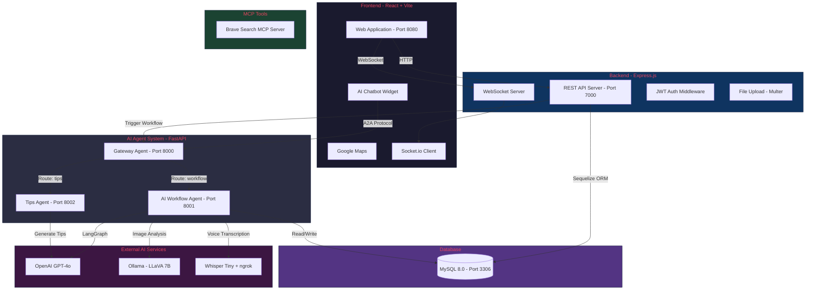
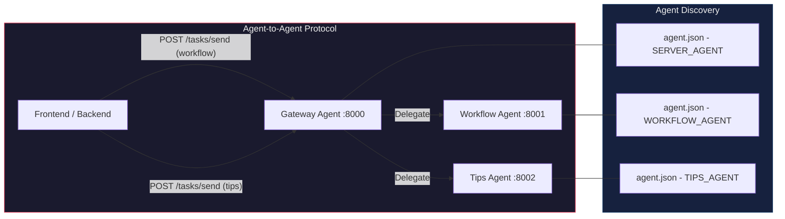
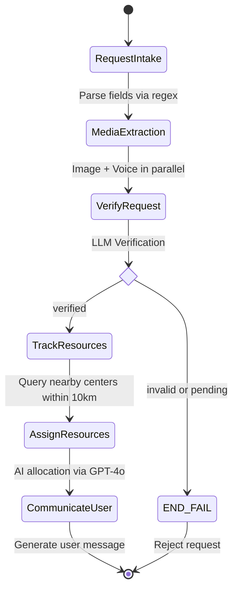
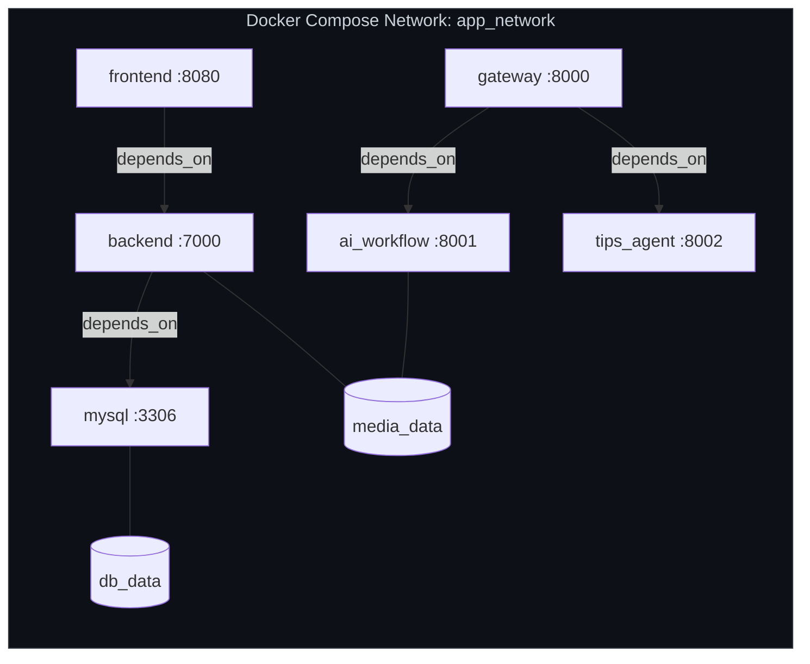
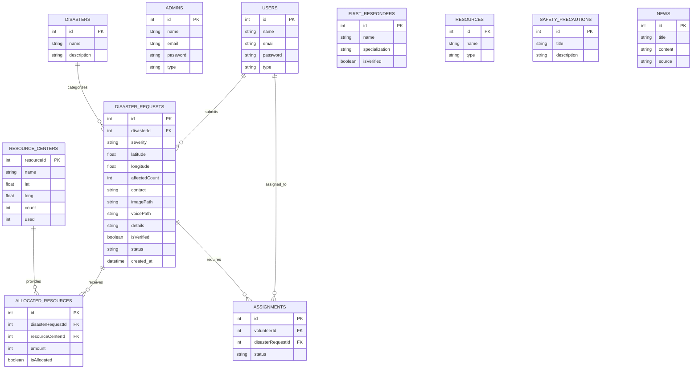

<p align="center">
  
</p>

<h1 align="center">🛡️ SurvivorSync</h1>

<p align="center">
  <strong>An AI-Powered Disaster Management & Response Platform</strong>
</p>

<p align="center">
  
  
  
  
  
  
  
  
  
</p>

---

## 📋 Table of Contents

- [Overview](#-overview)
- [Key Features](#-key-features)
- [System Architecture](#-system-architecture)
- [Technology Stack](#-technology-stack)
- [Project Structure](#-project-structure)
- [AI Agent Architecture](#-ai-agent-architecture)
- [LangGraph Workflow](#-langgraph-disaster-workflow)
- [API Reference](#-api-reference)
- [Getting Started](#-getting-started)
- [Environment Variables](#-environment-variables)
- [Docker Deployment](#-docker-deployment)
- [Model Fine-Tuning](#-model-fine-tuning)
- [License](#-license)

---

## 🌟 Overview

**SurvivorSync** is a production-ready, AI-powered disaster management platform built by **Team DataMavericks**. It enables citizens to report disasters in real-time (with image, voice, and text), uses a multi-agent AI system to verify requests and intelligently allocate resources, and provides first responders with an operational dashboard for coordinated emergency response.

The platform implements the **Agent-to-Agent (A2A)** communication protocol, where specialized AI microservices collaborate through a central gateway to process disaster reports end-to-end — from intake and verification to resource allocation and user communication.

---

## ✨ Key Features

| Feature | Description |
|---|---|
| 🆘 **Disaster Reporting** | Citizens submit reports with images, voice recordings, location, and severity levels |
| 🤖 **AI-Powered Verification** | Multi-modal verification using image analysis (LLaVA), voice transcription (Whisper), and LLM reasoning (GPT-4o) |
| 📦 **Smart Resource Allocation** | AI agent determines optimal resource distribution from nearby centers based on proximity and availability |
| 🗺️ **Interactive Map** | Google Maps integration for visualizing disaster locations and resource centers |
| 💬 **AI Chatbot** | Floating chatbot for safety tips and disaster preparedness advice |
| 📡 **Real-Time Chat** | Socket.io powered global chat for coordination between users |
| 👮 **First Responder Portal** | Management dashboard for admins (Police, Army, Hospital, NGO, etc.) |
| 📰 **News Feed** | Live disaster-related news updates |
| 📱 **WhatsApp Integration** | Send alerts and messages via WhatsApp |
| 📊 **PDF Reports** | Generate and export emergency reports |
| 🔐 **JWT Authentication** | Role-based access control with cookie-based tokens |

---

## 🏗️ System Architecture



---

## 🧰 Technology Stack

### Frontend
| Technology | Purpose |
|---|---|
| **React 18** + **TypeScript** | UI framework |
| **Vite** | Build tool & dev server |
| **TailwindCSS** | Utility-first CSS styling |
| **shadcn/ui** (Radix UI) | Accessible component library |
| **React Router v6** | Client-side routing |
| **TanStack React Query** | Data fetching & caching |
| **Recharts** | Data visualization & charts |
| **Socket.io Client** | Real-time WebSocket communication |
| **Google Maps API** | Map rendering & geolocation |
| **React PDF Renderer** | PDF report generation |
| **Zod** + **React Hook Form** | Form validation |
| **Lucide React** | Icon system |

### Backend
| Technology | Purpose |
|---|---|
| **Express.js v5** | REST API framework |
| **Sequelize** | MySQL ORM |
| **MySQL 8.0** | Relational database |
| **Socket.io** | WebSocket server for real-time chat |
| **JWT** | Authentication & authorization |
| **Multer** | File upload handling (images, voice) |
| **bcrypt** | Password hashing |
| **cookie-parser** | Cookie-based auth tokens |

### AI Agent System
| Technology | Purpose |
|---|---|
| **FastAPI** | Agent microservice framework |
| **LangGraph** | Multi-agent workflow orchestration |
| **OpenAI GPT-4o** | LLM for verification, resource allocation, and communication |
| **Ollama + LLaVA 7B** | On-premises image analysis |
| **OpenAI Whisper** (Tiny) | Speech-to-text transcription |
| **Pydantic** | Data validation & structured outputs |
| **MCP (Model Context Protocol)** | Tool integration (Brave Search) |

### DevOps & Infrastructure
| Technology | Purpose |
|---|---|
| **Docker Compose** | Multi-container orchestration |
| **ngrok** | Tunnel for Whisper/Ollama services |
| **Unsloth** | LLM fine-tuning framework |

---

## 📁 Project Structure

```
SurvivorSync-DataMavericks/
│
├── 📂 presentation/
│   └── 📂 frontend/                   # React + Vite Frontend
│       ├── src/
│       │   ├── pages/                  # Page components (Index, Login, Report, etc.)
│       │   ├── components/             # Reusable UI components
│       │   │   ├── DisasterReportForm  # Disaster submission form
│       │   │   ├── DisasterMap         # Google Maps visualization
│       │   │   ├── FloatingChatbot     # AI safety tips chatbot
│       │   │   ├── GlobalChat          # Real-time Socket.io chat
│       │   │   ├── Navigation          # App navigation bar
│       │   │   └── ui/                 # shadcn/ui primitives
│       │   ├── context/                # Auth context provider
│       │   ├── hooks/                  # Custom React hooks
│       │   └── types/                  # TypeScript type definitions
│       ├── Dockerfile
│       └── package.json
│
├── 📂 main_server/                     # Express.js Backend API
│   ├── config/
│   │   └── db.js                       # Sequelize MySQL connection
│   ├── controllers/                    # Route handlers
│   │   ├── authController.js           # User registration & login
│   │   ├── adminController.js          # Admin (first responder org) management
│   │   ├── disasterController.js       # Disaster CRUD
│   │   ├── disasterRequestController.js # Disaster request processing
│   │   ├── resourceController.js       # Resource management
│   │   ├── resourceCenterController.js # Resource center operations
│   │   ├── allocationController.js     # Resource allocation tracking
│   │   ├── assignmentController.js     # Volunteer task assignments
│   │   ├── firstResponderController.js # First responder management
│   │   ├── newsController.js           # News feed
│   │   └── whatsAppConroller.js        # WhatsApp messaging
│   ├── models/                         # Sequelize data models
│   │   ├── user.js                     # User (victim/volunteer)
│   │   ├── admin.js                    # Admin organizations
│   │   ├── Disaster.js                 # Disaster types
│   │   ├── DisasterRequest.js          # Disaster reports from users
│   │   ├── Resource.js                 # Resource types
│   │   ├── ResourceCenter.js           # Resource center locations
│   │   ├── AllocatedResource.js        # Resource allocations
│   │   ├── Assignment.js               # Volunteer assignments
│   │   ├── FirstResponder.js           # First responder profiles
│   │   └── News.js                     # News articles
│   ├── middleware/
│   │   ├── authMiddleware.js           # JWT token verification & role guards
│   │   └── upload.js                   # Multer file upload config
│   ├── routes/                         # Express route definitions
│   ├── seed.js                         # Database seeder
│   ├── server.js                       # App entry point
│   └── Dockerfile
│
├── 📂 agentapi/                        # AI Agent Microservices
│   ├── 📂 gateway/                     # Gateway Agent (Router)
│   │   └── app/
│   │       ├── api/api_routes.py       # A2A routing logic
│   │       ├── models/                 # Pydantic request/response models
│   │       └── main.py                 # FastAPI app (Port 8000)
│   │
│   ├── 📂 ai_workflow/                 # Disaster Workflow Agent
│   │   └── app/
│   │       ├── agents/                 # LangGraph agent nodes
│   │       │   ├── request_intake.py   # Parse incoming disaster requests
│   │       │   ├── media_extraction.py # Image (LLaVA) & voice (Whisper) analysis
│   │       │   ├── verify_request.py   # LLM-based request verification
│   │       │   ├── resource_tracking.py# Query nearby resource centers
│   │       │   ├── resource_assign.py  # AI-driven resource allocation
│   │       │   └── user_communication.py # Generate user-facing response
│   │       ├── workflows/
│   │       │   └── disaster_workflow.py # LangGraph state machine definition
│   │       ├── db/resource_db.py       # Direct MySQL queries for resources
│   │       ├── models/agent_state.py   # Pydantic state model
│   │       └── main.py                 # FastAPI app (Port 8001)
│   │
│   ├── 📂 tips_agent/                  # Safety Tips Agent
│   │   └── app/
│   │       ├── agents/tips_agent.py    # GPT-4o powered tip generation
│   │       ├── api/tips_routes.py      # A2A task endpoint
│   │       └── main.py                 # FastAPI app (Port 8002)
│   │
│   ├── 📂 whisper_tiny/                # Whisper Transcription Service
│   │   └── whisper_global.py           # Flask + ngrok + Whisper Tiny model
│   │
│   ├── 📂 mcps/                        # MCP Tool Servers
│   │   └── brave_search_mcp_server.py  # Brave Search API integration
│   │
│   ├── 📂 finetuning/                  # Model Fine-Tuning Notebooks
│   │   ├── Llama3_(8B)_Ollama.ipynb
│   │   ├── Qwen3_(4B)_GRPO.ipynb
│   │   └── Qwen_4B_FirstAid_Model.ipynb
│   │
│   └── 📂 models/                      # Shared Pydantic models
│
├── 📂 unsloth/                         # Unsloth fine-tuning environment
├── docker-compose.yml                  # Full-stack orchestration
└── Readme.md
```

---

## 🤖 AI Agent Architecture

The AI system follows the **Agent-to-Agent (A2A) Protocol** with discoverable agent cards at `/.well-known/agent.json`.



### Agent Descriptions

| Agent | Port | Role |
|---|---|---|
| **Gateway Agent** | `8000` | Routes incoming A2A tasks to the correct downstream agent (`tips` or `workflow`) |
| **Workflow Agent** | `8001` | Orchestrates the full disaster request pipeline via LangGraph |
| **Tips Agent** | `8002` | Generates safety tips and conversational responses using GPT-4o |

---

## 🔄 LangGraph Disaster Workflow

The core disaster processing pipeline is built as a **LangGraph state machine** with 6 agent nodes:



### Node Details

| # | Node | Description | AI Model |
|---|---|---|---|
| 1 | **Request Intake** | Parses structured fields (disaster type, severity, GPS, contact, media paths) from the text message using regex | — |
| 2 | **Media Extraction** | Processes image via **LLaVA 7B** (Ollama) and voice via **Whisper Tiny** in parallel threads | LLaVA 7B, Whisper |
| 3 | **Verify Request** | Cross-references text, image description, and voice transcription. Auto-verifies if ≥5 similar reports exist within 10km today | GPT-4o |
| 4 | **Track Resources** | Queries MySQL for resource centers within 10km radius using `ST_Distance_Sphere` | — |
| 5 | **Assign Resources** | Applies allocation rules (no over-allocation, keep reserves, proximity-first) and writes assignments to DB | GPT-4o |
| 6 | **Communicate with User** | Generates an empathetic, structured message informing the user of their request status | GPT-4o |

---

## 📡 API Reference

### Backend API (Express.js — Port 7000)

#### Authentication
| Method | Endpoint | Auth | Description |
|---|---|---|---|
| `POST` | `/api/users/register` | ❌ | Register a new user (victim/volunteer) |
| `POST` | `/api/users/login` | ❌ | Login and receive JWT cookie |
| `GET` | `/api/users/users` | 🔒 | Get all users |
| `GET` | `/api/users/users/:id` | 🔒 | Get user by ID |
| `PUT` | `/api/users/users/:id` | 🔒 | Update user |
| `DELETE` | `/api/users/users/:id` | 🔒 | Delete user |
| `GET` | `/api/users/count/volunteers-victims` | ❌ | Get volunteer & victim counts |
| `GET` | `/api/users/volunteers` | ❌ | List all volunteers |

#### Admin (First Responder Organizations)
| Method | Endpoint | Auth | Description |
|---|---|---|---|
| `POST` | `/api/admin/register` | ❌ | Register admin organization |
| `POST` | `/api/admin/login` | ❌ | Admin login |
| `GET` | `/api/admin/refresh` | ❌ | Refresh admin token |
| `GET` | `/api/admin/admins` | 🔒 | List all admin organizations |
| `GET` | `/api/admin/profile` | 🔒 | Get current admin profile |

#### Disaster Management
| Method | Endpoint | Auth | Description |
|---|---|---|---|
| `POST` | `/api/disasters` | 🔒 | Create a disaster type |
| `GET` | `/api/disasters` | ❌ | List all disaster types |
| `GET` | `/api/disasters/count` | ❌ | Get total disaster count |
| `GET` | `/api/disasters/:id` | ❌ | Get disaster by ID |
| `PUT` | `/api/disasters/:id` | 🔒 | Update disaster |
| `DELETE` | `/api/disasters/:id` | 🔒 | Delete disaster |

#### Disaster Requests (Reports)
| Method | Endpoint | Auth | Description |
|---|---|---|---|
| `POST` | `/api/requests` | ❌ | Submit a disaster report (with image/voice upload) |
| `GET` | `/api/requests` | ❌ | List all disaster reports |
| `GET` | `/api/requests/userId` | ❌ | Get requests by user |
| `GET` | `/api/requests/verified` | ❌ | Get only verified requests |
| `PUT` | `/api/requests/:id` | ❌ | Update a request |
| `DELETE` | `/api/requests/:id` | ❌ | Delete a request |
| `GET` | `/api/disaster-stats` | ❌ | Export disaster statistics |
| `GET` | `/api/district-disaster-summary` | ❌ | Get district-level summary |
| `GET` | `/api/disasters/totals/current-year` | ❌ | Current year disaster totals |

#### Resource Management
| Method | Endpoint | Auth | Description |
|---|---|---|---|
| `POST` | `/api/resources` | 🔒 | Create a resource type |
| `GET` | `/api/resources` | 🔒 | List all resources |
| `GET` | `/api/resources/:id` | 🔒 | Get resource by ID |
| `PUT` | `/api/resources/:id` | 🔒 | Update resource |
| `DELETE` | `/api/resources/:id` | 🔒 | Delete resource |

#### Resource Centers
| Method | Endpoint | Auth | Description |
|---|---|---|---|
| `POST` | `/api/resource-centers` | ❌ | Create resource center |
| `GET` | `/api/resource-centers` | ❌ | List all resource centers |
| `GET` | `/api/resource-centers/count` | ❌ | Get center count |
| `GET` | `/api/resource-centers/summary` | ❌ | Get resource center summary |
| `GET` | `/api/resource-centers/:id` | ❌ | Get center by ID |
| `PUT` | `/api/resource-centers/:id` | ❌ | Update center |
| `DELETE` | `/api/resource-centers/:id` | ❌ | Delete center |

#### Allocations
| Method | Endpoint | Auth | Description |
|---|---|---|---|
| `POST` | `/api/allocations` | ❌ | Create allocation |
| `GET` | `/api/allocations` | ❌ | List all allocations |
| `GET` | `/api/allocations/summary` | ❌ | Get allocation summaries |
| `GET` | `/api/allocations/:id` | ❌ | Get allocation by ID |
| `PUT` | `/api/allocations/:id` | ❌ | Update allocation |
| `DELETE` | `/api/allocations/:id` | ❌ | Delete allocation |

#### First Responders
| Method | Endpoint | Auth | Description |
|---|---|---|---|
| `POST` | `/api/first-responders/register` | ❌ | Register first responder |
| `GET` | `/api/first-responders/admins` | ❌ | List all first responders |
| `PUT` | `/api/first-responders/verify` | ❌ | Verify a first responder |
| `GET` | `/api/first-responders/profile` | 🔒 | Get responder profile |

#### Assignments
| Method | Endpoint | Auth | Description |
|---|---|---|---|
| `POST` | `/api/assignments` | ❌ | Create assignment |
| `GET` | `/api/assignments` | ❌ | List all assignments |
| `GET` | `/api/assignments/summary` | ❌ | Get formatted assignments |
| `GET` | `/api/assignments/volunteer-assignments/:volunteerId` | ❌ | Get assignments by volunteer |
| `PUT` | `/api/assignments/:id` | ❌ | Update assignment |

#### Other
| Method | Endpoint | Auth | Description |
|---|---|---|---|
| `POST` | `/api/whatsapp/send/msg` | ❌ | Send WhatsApp message |
| `GET` | `/api/news` | ❌ | List news articles |
| `POST` | `/api/news` | ❌ | Create news article |
| `POST` | `/api/availability` | ❌ | Set resource availability |
| `GET` | `/api/availability` | ❌ | List availabilities |
| `GET` | `/api/precautions` | ❌ | List safety precautions |
| `POST` | `/api/precautions` | ❌ | Create precaution |

---

### AI Agent API (FastAPI)

#### Gateway Agent (Port 8000)
| Method | Endpoint | Description |
|---|---|---|
| `GET` | `/.well-known/agent.json` | Agent discovery card |
| `GET` | `/health` | Health check |
| `POST` | `/tasks/send` | Route task to downstream agent |

**Example — Route to Tips Agent:**
```bash
curl -X POST http://localhost:8000/tasks/send \
  -H "Content-Type: application/json" \
  -d '{
    "agent": "tips",
    "input": {
      "message": "What should I do during an earthquake?"
    }
  }'
```

**Example — Route to Workflow Agent:**
```bash
curl -X POST http://localhost:8000/tasks/send \
  -H "Content-Type: application/json" \
  -d '{
    "agent": "workflow",
    "input": {
      "message": "Request Id: 42\nDisaster: Flood\nDisaster ID: 3\nSeverity: High\nLatitude 6.9271, Longitude 79.8612\nAffected Count: 150\nContact No: +94771234567\nImage_path: uploads/images/flood_colombo.jpg\nVoice_path: uploads/voice/report_42.mp3\nDetails: Severe flooding in low-lying areas, water level rising rapidly"
    }
  }'
```

#### Workflow Agent (Port 8001)
| Method | Endpoint | Description |
|---|---|---|
| `GET` | `/.well-known/agent.json` | Agent discovery card |
| `GET` | `/health` | Health check |
| `POST` | `/tasks/send` | Execute disaster workflow |

**Example Request:**
```bash
curl -X POST http://localhost:8001/tasks/send \
  -H "Content-Type: application/json" \
  -d '{
    "input": {
      "message": "Request Id: 42\nDisaster: Flood\nDisaster ID: 3\nSeverity: Critical\nLatitude 6.9271, Longitude 79.8612\nAffected Count: 200\nContact No: +94771234567\nDetails: Major flooding in residential area"
    }
  }'
```

**Example Response:**
```json
{
  "state": {
    "agent": "workflow",
    "input": { "message": "..." },
    "request": {
      "request_id": 42,
      "disaster": "Flood",
      "disaster_id": 3,
      "disaster_status": "critical",
      "location": [6.9271, 79.8612],
      "affected_count": 200
    },
    "image_description": "Flooded residential area with submerged vehicles...",
    "voice_description": "Help needed urgently, water levels are rising...",
    "status": "verified",
    "reason": "Image and voice descriptions align with flood report",
    "allocated_resources": {
      "request_id": 42,
      "resource_center_ids": [5, 12],
      "quantities": [30, 20]
    },
    "disaster_status": "IN_PROGRESS",
    "user_msg": {
      "message": "Stay strong! Your flood report has been verified. 50 units of emergency supplies are on their way from 2 nearby resource centers. Help will reach your area soon."
    },
    "error_msg": null
  }
}
```

#### Tips Agent (Port 8002)
| Method | Endpoint | Description |
|---|---|---|
| `GET` | `/.well-known/agent.json` | Agent discovery card |
| `GET` | `/health` | Health check |
| `POST` | `/tasks/send` | Get safety tips |

**Example Request:**
```bash
curl -X POST http://localhost:8002/tasks/send \
  -H "Content-Type: application/json" \
  -d '{
    "input": {
      "message": "How to stay safe during a tsunami?"
    }
  }'
```

**Example Response:**
```json
{
  "state": {
    "agent": "workflow",
    "input": { "message": "How to stay safe during a tsunami?" },
    "status": "pending",
    "user_msg": {
      "message": "Here are 3 critical tsunami safety tips:\n1. Move to higher ground immediately — don't wait for official warnings.\n2. Stay away from the coast, rivers, and streams.\n3. If caught in the water, grab onto something that floats and wait for rescue."
    },
    "error_msg": null
  }
}
```

---

## 🚀 Getting Started

### Prerequisites

- **Node.js** ≥ 18 & **npm**
- **Python** ≥ 3.10
- **Docker** & **Docker Compose**
- **MySQL** 8.0 (or via Docker)
- **OpenAI API Key**
- **Google Maps API Key**
- (Optional) **Ollama** with LLaVA 7B model for local image analysis
- (Optional) **ngrok** account for tunneling Whisper service

---

### Option 1: Docker Compose (Recommended)

The fastest way to run the entire stack:

```bash
# Clone the repository
git clone https://github.com/NisalDeZoysa/SurvivorSync-DataMavericks.git
cd SurvivorSync-DataMavericks

# Configure environment files (see Environment Variables section)
# Create .env files for: main_server/, agentapi/gateway/, agentapi/ai_workflow/, agentapi/tips_agent/

# Start all services
docker-compose up --build
```

This will start:
| Service | Container | Port |
|---|---|---|
| Frontend | `ui` | `http://localhost:8080` |
| Backend | `backend` | `http://localhost:7000` |
| Gateway Agent | `gateway_service` | `http://localhost:8000` |
| Workflow Agent | `ai_workflow_service` | `http://localhost:8001` |
| Tips Agent | `tips_agent_service` | `http://localhost:8002` |
| MySQL | `mysql` | `localhost:33081` |

---

### Option 2: Manual Setup

#### 1. Database

```bash
# Start MySQL (or use Docker)
docker run -d --name mysql -e MYSQL_ROOT_PASSWORD=root -e MYSQL_DATABASE=survivorsync -p 33081:3306 mysql:8.0
```

#### 2. Backend (Express.js)

```bash
cd main_server
cp .env.example .env        # Configure your environment variables
npm install
npm run dev                  # Starts on port 7000
```

#### 3. Frontend (React + Vite)

```bash
cd presentation/frontend
cp .env.example .env         # Set VITE_API_BASE_URL and VITE_MAP_API_KEY
npm install
npm run dev                  # Starts on port 8080
```

#### 4. AI Agents

```bash
# Gateway Agent
cd agentapi/gateway
pip install -r requirements.txt
uvicorn app.main:app --host 0.0.0.0 --port 8000

# Workflow Agent
cd agentapi/ai_workflow
pip install -r requirements.txt
uvicorn app.main:app --host 0.0.0.0 --port 8001

# Tips Agent
cd agentapi/tips_agent
pip install -r requirements.txt
uvicorn app.main:app --host 0.0.0.0 --port 8002
```

#### 5. Whisper Service (Optional — for voice transcription)

```bash
cd agentapi/whisper_tiny
pip install flask openai-whisper pyngrok tqdm requests imageio-ffmpeg python-dotenv ollama
python whisper_global.py     # Starts on port 5060 + ngrok tunnel
```

---

## 🔐 Environment Variables

### `main_server/.env`
```env
PORT=7000
DB_HOST=db                   # Use 'localhost' for local, 'db' for Docker
DB_PORT=3306
DB_NAME=survivorsync
DB_USER=root
DB_PASSWORD=root
ACCESS_TOKEN_SECRET=your_jwt_secret
REFRESH_TOKEN_SECRET=your_refresh_jwt_secret
```

### `presentation/frontend/.env`
```env
VITE_API_BASE_URL=http://localhost:7000
VITE_MAP_API_KEY=your_google_maps_api_key
```

### `agentapi/gateway/.env`
```env
TIPS_URL=http://tips_agent_service:8002    # Docker service name
WORKFLOW_URL=http://ai_workflow_service:8001
```

### `agentapi/ai_workflow/.env`
```env
OPENAI_API_KEY=your_openai_api_key
NGROK_URL=https://your-ngrok-url          # For Ollama LLaVA access
TRANSCRIBE_URL=https://your-ngrok-url     # For Whisper access
```

### `agentapi/tips_agent/.env`
```env
OPENAI_API_KEY=your_openai_api_key
NGROK_URL=https://your-ngrok-url
```

---

## 🐳 Docker Deployment



### Container Dependency Chain
```
mysql ─► backend ─► frontend
                 └─► ai_workflow ─► gateway
                 └─► tips_agent  ─┘
```

### Health Checks
All AI agent containers include health checks:
- `gateway`: `GET http://localhost:8000/health`
- `ai_workflow`: `GET http://localhost:8001/health`
- `tips_agent`: `GET http://localhost:8002/health`

### Volumes
| Volume | Purpose |
|---|---|
| `db_data` | Persistent MySQL storage |
| `media_data` | Shared upload directory (images, voice) between backend and AI workflow |

---

## 🧪 Model Fine-Tuning

The project includes Jupyter notebooks for fine-tuning LLMs using **Unsloth** for disaster-specific tasks:

| Notebook | Description |
|---|---|
| `Llama3_(8B)_Ollama.ipynb` | Fine-tune Llama 3 8B for Ollama deployment |
| `Qwen3_(4B)_GRPO.ipynb` | Fine-tune Qwen 3 4B using GRPO (Group Relative Policy Optimization) |
| `Qwen_4B_FirstAid_Model.ipynb` | Fine-tune Qwen 4B specifically for first-aid response generation |

These fine-tuned models can replace the OpenAI API calls for on-premises, cost-effective deployment.

---

## 🗄️ Database Schema



---

## 🔑 User Roles & Permissions

| Role | Access |
|---|---|
| **Victim** | Submit disaster reports, view status, chat |
| **Volunteer** | View assignments, field observations, availability |
| **Admin** (Police, Army, Hospital, Redcross, NGO, Government) | Full dashboard, manage resources, approve first responders, manage allocations |
| **First Responder** | Field operations, assignment management |

---

## 📄 License

MIT

---

<p align="center">
  Made with ❤️ by <strong>Team DataMavericks</strong>
</p>